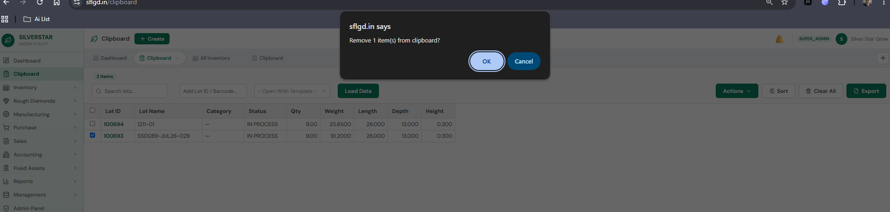

# Silverstar Grow — Unified Return Engine

**Status:** Live (v1.5.7) · **Verified:** 2026-07-14 · 48/48 unit tests · production build green
**Scope:** the single engine that returns material from a manufacturing process back into inventory, including Growth-identity routing, the authoritative Return Plan (preflight), posting, history, and immutable reversal.

---

## 1. Core principles (approved business rules)

1. **Growth Number is permanent.** The biscuit's `inventory.lot_number` (e.g. `SSD093-JUL26-030`) IS the Growth Number and never changes.
2. **Run Number is permanent for the current cycle.** `inventory.run_no` increments only at Growth-Again issue — never at return.
3. **A full usable Growth Return reuses the existing Growth biscuit.** No child lot, no generated code.
4. **The user never types, selects or manufactures a Return identity.** Identity, category and route are displayed from the server plan only.
5. **The server is authoritative** for: route, target lot, Growth Number, Run Number, item category, whether a new lot is created, remaining-in-process, and reversal support. Client-supplied values never override the plan; the client's `remaining_in_process` is ignored entirely.
6. **Inventory is the source of physical truth.**
7. **One engine.** `LotReturnPage.jsx` is the only Return workspace; `POST /api/lot-process-issues/:id/return` is the only posting endpoint. No duplicate pages, endpoints or routing engines.
8. **Posting recomputes the plan under database locks.** A preflight response is display-only and never trusted.
9. **ERP transactions are never physically deleted.** Cancellation = immutable reversal; the original stays visible as `REVERSED`.

---

## 2. Architecture map

| File | Responsibility |
|---|---|
| `server/services/returnRouting.js` | **Pure domain logic** (no I/O): `resolveAllowedOutputs`, `resolveGrowthReturnRoute`, `buildReturnPlan`, `normalizeGrowthUsableOutputs`, `reversalBlockReason` |
| `server/routes/lotProcessIssues.js` | Issue list/detail, **preflight** `POST /:id/return/validate`, **posting** `POST /:id/return` |
| `server/routes/inventory.js` | Lot Transaction History (`GET /:id/history`), reversal eligibility + `POST /history/reverse` |
| `server/services/reversalOrchestrator.js` | P2 reversal dispatch by canonical transaction key |
| `server/services/growthReturnReversal.js` | `reverseGrowthReturn` — locked restoration from `pre_state` (version 2) |
| `server/routes/processMaster.js` | Process configuration CRUD — **normalizes GROWTH usable rules on write** |
| `client/src/modules/inventory/pages/LotReturnPage.jsx` | The only Return workspace (route + modal modes) |
| `client/src/modules/inventory/components/LotHistoryTab.jsx` | Transaction Register (full-width, filters, CSV, Reverse action) |
| `client/src/modules/inventory/pages/ProcessReturnsListPage.jsx` | Pending-returns register |
| `server/tests/growthReturnRouting.test.js` | 41 unit tests over the pure domain logic |

---

## 3. Identity model

- **Process lot** (e.g. `1211-01`): the seed quantity issued into the reactor. Consumed on final return.
- **Growth biscuit**: the single `inventory` row with `item.category = 'growth_run'`, created idempotently at Start Process and linked by `machine_process_id`. Its `lot_number` is the Growth Number; `run_no` is the Run (displayed `R1`, `R2`…).
- **Return child lots** (`1211-01-R1`, `-D1`, `-C1`): created **only** on the CHILD route. The suffix letter comes from the output rule's `suffix`; the trailing number is a per-suffix sequence (`nextReturnLotCode`). A return suffix is **not** a Run Number.
- **Zero or multiple biscuits** on one machine process is a data-integrity conflict — the engine refuses to guess (see §6).

---

## 4. Configuration — `process_master.allowed_outputs` (JSONB)

Each process declares its return outputs:

```json
[
  { "type": "usable",   "label": "Partial Growth Run", "suffix": "R", "status": "IN STOCK",
    "item_category_override": "growth_run" },
  { "type": "damaged",  "label": "Damaged",  "suffix": "D", "status": "DAMAGED" },
  { "type": "consumed", "label": "Consumed", "suffix": "C", "status": "CONSUMED" }
]
```

- `type` — line type key; `suffix`/`status` — child-lot code letter and resulting status.
- `item_category_override` — output becomes a different item category. **On a GROWTH-group process, every `usable` rule MUST map to `growth_run`** — the engine hard-rejects anything else at return time.
- `component` — tags a rule into a component group (e.g. seed / diamond) and switches the whole process into COMPONENT mode (§5).
- Rows with `allowed_outputs` NULL/empty fall back to the legacy usable/damaged/consumed set (`resolveAllowedOutputs`).

**Write guardrail:** `processMaster.js` POST/PATCH pass `allowed_outputs` through `normalizeGrowthUsableOutputs(effectiveGroup, outputs)` — GROWTH usable rules are forced to `growth_run` at save time, so an admin cannot store a config the engine will refuse. COMPONENT configs and non-GROWTH groups pass through untouched.

**Migration lineage:** phase34 (`process_group` column; `growth`→GROWTH, laser ops incl. `seed_remove`→LASER) · phase56 (`allowed_outputs` column + canonical configs for named codes) · phase58 (seeds missing native processes — without outputs) · phase59 (seed_remove dual component groups) · phase60 (reversal columns incl. `pre_state`) · **phase61 (repairs GROWTH-group rows — e.g. custom `pr-01` — whose usable rule lacked the `growth_run` override; the cause of the 2026-07 config-integrity rejections)**.

---

## 5. Conservation modes

**QUANTITY mode** (default — growth, laser, cuts): outputs are the same physical thing; quantities sum. `issued = usable + damaged + consumed (+ …)`. Remaining is **server-calculated**: `remaining = outstanding − Σ(lines)` (±0.0001); returning more than outstanding → `Balance mismatch`.

**COMPONENT mode** (any rule carries `component`; e.g. Seed Remove): the input splits into different components in different units. Each component group must **independently equal** the input quantity — groups are never summed. The input is wholly consumed (`remaining = 0`). Output weight may be less than input weight (process loss) but never more.

---

## 6. The Return Plan — `buildReturnPlan()`

One pure resolver shared by the preflight and the posting transaction. Inputs: issue row, process lot, biscuit (or null), `biscuitCandidateCount`, coalesced outputs, request lines, measurements, open-sibling count. Output:

| Field | Meaning |
|---|---|
| `valid` / `error` | gate result; every REJECT reason lands in `error` |
| `route` | `BISCUIT` \| `CHILD` \| `REJECT` |
| `target_lot_id/_code`, `growth_number`, `run_no` | authoritative identity |
| `will_create_new_lot`, `generated_child_code`, `line_identities[]` | per-line projected identities (CHILD codes are previews; regenerated under lock) |
| `is_final`, `return_total`, `remaining_after` | server-calculated balance |
| `projected_issue_status`, `projected_inventory_status`, `projected_qty/_weight` | post-return state |
| `reversal_supported` | true only for the full usable Growth Return |
| `in_place`, `growth_run_input` | biscuit-input (growth-again/laser) in-place flag |

### Routing truth table (GROWTH group, non-component, biscuit-target)

| Situation | Result |
|---|---|
| Exactly 1 line, usable→growth_run, qty = full outstanding (±0.0001), 1 biscuit | **BISCUIT** — return references the existing biscuit; no lot created; `run_no` untouched |
| Usable line whose rule is missing/incorrect `item_category_override` | **REJECT** — `Growth usable-output configuration is invalid. The usable output must map to the existing Growth Run identity.` |
| Usable growth line, **0** biscuit candidates | **REJECT** — `Growth biscuit or Growth Number was not found for this process. Return cannot be completed without the permanent Growth identity.` |
| **>1** biscuit candidates (any line mix) | **REJECT** — `Multiple Growth biscuits were found for this process. Return cannot continue until the Growth identity conflict is resolved.` |
| Partial or mixed (usable + damaged/consumed) | **REJECT** — `Phase 1: … must return the FULL outstanding quantity as a single usable line…` |
| Damaged/consumed-only | **CHILD** (legacy child lots) |
| Non-GROWTH process, COMPONENT mode, or biscuit-input (growth-again/laser) | **CHILD** path / dedicated in-place branch — untouched legacy behaviour |

---

## 7. Preflight — `POST /api/lot-process-issues/:id/return/validate`

- Auth: same as posting (`admin`, `operator`). **Zero writes** — SELECTs only, no locks, no transaction.
- Resolves the biscuit itself (all candidates, count checked) — independent of the detail API's `growth_number`.
- Body: same as posting (`lines[{type, qty, weight?, remarks?, item_id?}]`, `measurements?`; `remaining_in_process` ignored).
- Response: the full plan (§6) + `line_identities` + `generated_child_code`. Invalid plans return `{ valid:false, route:'REJECT', error }` with HTTP 200.

**Frontend contract (`LotReturnPage`):** debounced 400 ms on any line change; a monotonic sequence ref drops stale out-of-order responses; the plan is invalidated synchronously on change; **Record Return is disabled while pending/invalid**; the Return Identity column and the "Return Plan (server)" panel render only backend values (`previewCode` no longer exists); on a server-owned line (`will_create_new_lot === false`) the Item Category cell is read-only text — the backend ignores `item_id` on that branch.

---

## 8. Posting — `POST /api/lot-process-issues/:id/return`

Single transaction, in order:

1. Lock issue (`FOR UPDATE OF i`) with config joins.
2. Lock process lot (`FOR UPDATE OF inv`).
3. Lock **all** biscuit candidates (`FOR UPDATE`, no LIMIT), count them.
4. **Recompute the plan** with `buildReturnPlan` from the locked row images; throw on `!valid`.
5. Insert `lot_process_returns` header; for the BISCUIT route, capture the **`pre_state` snapshot** (version 2: remaining-before, process-lot qty/weight/value/status, biscuit identity/status/run/measurements, machine id).
6. Per line: BISCUIT → `process_return_lines` against the biscuit + one `return_usable` op-log entry (no inventory INSERT); CHILD → create child lot via `nextReturnLotCode` (+ dedupe check) with proportional weight/value; in-place (biscuit input) → record against the biscuit itself.
7. Return-time measurements apply to the biscuit in place (`applyMeasurements` + `recordGrowthCycle` + `growth_run_measured` op).
8. Update issue remaining/status; on final: consume the process lot (never the biscuit); OUTPUT_BASED completion advances the single biscuit to IN STOCK (`advanceGrowthRunToStock`) when no sibling issue stays OPEN.

Response: `{ return_number, return_id, issue_id, is_final, remaining_after, outcomes[] }` — biscuit outcomes carry `in_place:true, growth_number, run_no`.

---

## 9. Reversal (P2 — orchestrated)

- **Storage (phase60):** `lot_process_returns.status` (`ACTIVE`/`REVERSED`), `reversed_by/_at`, `reversal_reason`, `pre_state` JSONB. Only returns with a **version-2 `pre_state`** are reversible; legacy/incomplete records are refused (`…cannot be reversed safely. Please correct manually.`).
- **Eligibility (read-only):** `reversalOrchestrator.getReversalEligibility(canonicalTxKey, lotId)` — canonical keys like `lot_op_log:<id>` are resolved to `lot_process_return:<id>`; cross-lot keys rejected. Row-state rules live in the pure `reversalBlockReason`: not already REVERSED; pre_state present; final return; issue still RETURNED; biscuit exists with unchanged Growth Number / run_no / machine_process and status IN STOCK; machine process not completed. Endpoint-side SQL additionally blocks when later issues/movements/op-log entries exist downstream.
- **Execution:** `POST /api/inventory/history/reverse` → `reversalOrchestrator.reverseTransaction` → `reverseGrowthReturn(client, returnId, …)` — locks the header chain and performs strict field-by-field restoration (issue reopened with remaining-before; process lot qty/weight/value/status restored; biscuit status/measurements restored — identity fields never written; machine back to running; `return_reversed` op-log entries; reversal growth-cycle when measurements changed). The header is marked `REVERSED` with reason/user/time — never deleted.
- **UI:** the History register shows a Reverse action only on rows the server marks `reversible` (ACTIVE + `pre_state` present + canonical `return_usable` event); `CancellationModal` collects the mandatory reason and shows the impact preview. Exactly one reversible row exists per return (PK joins — no fan-out). Duplicate reversal → `This Growth Return has already been reversed.`

---

## 10. Lot Transaction History — `GET /api/inventory/:id/history`

Five-source UNION (creation, op-log, movement parent/child, growth cycles) with: `doc_no` (issue/return number), `return_id`, `txn_status` (`REVERSED` when the linked return is reversed), `reversible`, and `qty_after` reconstructed over the full chronology (creation + op-log deltas only; `return_reversed` events excluded) so date filters never distort balances. Server pagination (`limit/offset`, `{data, total}`), filters `date_from/date_to/source`. The register UI is full-width (History tab only), Details column flexes with ellipsis, CSV export included.

---

## 11. Error catalogue

| Message (exact) | Cause |
|---|---|
| `Growth usable-output configuration is invalid. The usable output must map to the existing Growth Run identity.` | GROWTH usable rule missing/incorrect `item_category_override` — fix config (phase61 / ProcessMaster) |
| `Growth biscuit or Growth Number was not found for this process. …` | No biscuit on the machine process — data integrity, never auto-created |
| `Multiple Growth biscuits were found for this process. …` | >1 biscuit candidates — resolve the duplicate identity first |
| `Phase 1: a Growth Return with a usable output must return the FULL outstanding quantity as a single usable line. …` | Partial or mixed usable growth return (incl. falsified `remaining_in_process`) |
| `Balance mismatch: …` | Returning more than outstanding |
| `<component> outputs total X but must equal the Y in process. …` | COMPONENT group short/over |
| `Output weight X exceeds input weight Y — a component split cannot create mass.` | COMPONENT mass gate |
| `Growth Run returns must use a single disposition.` | Biscuit-input return with multiple lines |
| `This Growth Return has already been reversed.` | Duplicate reversal |
| `Legacy or incomplete return records cannot be reversed safely. Please correct manually.` | `pre_state` missing or not version 2 |

---

## 12. Testing

`server/tests/growthReturnRouting.test.js` (+ `lotDimensions.test.js`) — **48 tests**: 13 routing truth-table, 16 `buildReturnPlan` (full-usable→BISCUIT, partial/mixed/zero-biscuit/multi-biscuit/config REJECTs, falsified-remaining, COMPONENT equality, in-place, over-return), 4 `normalizeGrowthUsableOutputs`, 8 `reversalBlockReason`, 7 dimension-inheritance. Pure modules only — no DB required. Run: `node --test server/tests/growthReturnRouting.test.js server/tests/lotDimensions.test.js`.

---

## 13. Operations

- **Ship path:** `npm run build` (vite → `client/dist` → copied to `server/public`) + server deploy + pm2 restart. Nothing reaches users without this.
- **Migrations are manual** (EC2 psql), never auto-run. Current pending item: **phase61** (config repair). Skip phase57 (superseded by phase59).
- **Post-deploy smoke:** preflight a full usable growth return → plan shows `BISCUIT / <Growth Number> / R<n> / New lot NO / Reversible YES`; record it; verify History shows one reversible `return_usable` row; reverse it; verify restoration; duplicate reversal → 400.
- **Config health check:**

  ```sql
  SELECT process_code, e->>'type' AS type, e->>'item_category_override' AS override
  FROM process_master pm, jsonb_array_elements(pm.allowed_outputs) e
  WHERE pm.process_group = 'GROWTH';
  ```

## 14. Invariants — never do

- Never create a second Return page/endpoint/engine (`LotReturnPageV2`, `ReturnEngine2`, …).
- Never mint a replacement Growth identity or fall back to CHILD for a GROWTH usable output.
- Never trust client `remaining_in_process`, identity, category or route.
- Never modify `growthRunService.nextGrowthRunNumber`, `nextReturnLotCode` semantics, or the `run_no` increment.
- Never physically delete a return — reversal only.
- Never auto-run migrations; never touch Seed Remove / COMPONENT behaviour from growth-return work.
